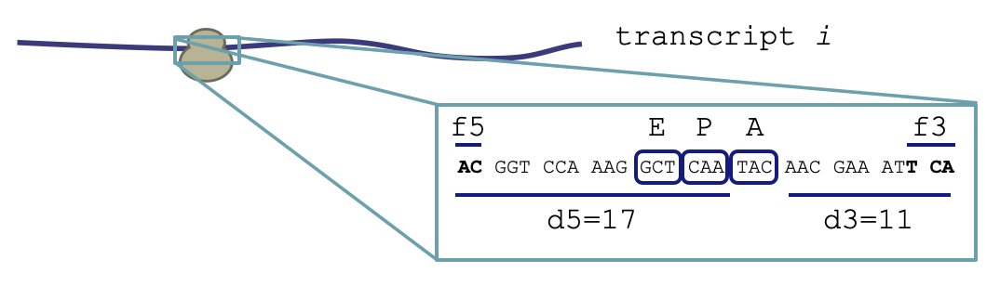

```{r, include = FALSE}
knitr::opts_chunk$set(
  collapse = TRUE,
  comment = "#>"
)
```

```{r setup}
library(simRiboSeq)
```

# simRiboSeq workflow

1. Generate transcriptome
- If using real transcriptome, load with `read_fasta()`
- Simulate transcriptome with `simulate_transcriptome()`
2. Generate per-codon-position probabilities of ribosome occupancy
- `rho`: per-transcript probabilities; sum to 1 over transcriptome
- `pi`: per-codon-position probabilities; sum to 1 over individual transcript
3. Simulate footprint sequences
- Simulate ribosome occupancy counts
- Simulate RNase digestion --> generate footprint sequence
- Simulate biased footprint recovery based on 3' end nucleotides
- Simulate biased footprint recovery based on 5' end nucleotides
- Simulate addition of non-templated nucleotide to footprint 5' end
- Repeat until library size has been reached




# Example simulation

## 0. Establish simulation parameters:

- Number of reads
- Maximum, minimum footprint sizes
- Footprint size distributions (determined by 5' and 3' digest lengths [d5, d3])
- Footprint recovery probabilities (determined by end sequences [f5, f3])
- Probability of non-templated addition to footprint 5' end

```{r simulation_parameters}
# specify footprint sizes, library size
min_size <- 27
max_size <- 31
num_reads <- 10

# load simulation parameters
data("d5_bias", "d3_bias", "f5_bias", "f3_bias", "codon_TE", "rt_bias",
     package="simRiboSeq")
```

## 1. Load tiny transcriptome

```{r load_transcriptome}
transcript_fasta <- system.file("extdata", "tiny_2genes_20utrs.fa",
                                package="simRiboSeq")
transcript_seq <- read_fasta(transcript_fasta, utr5_length=20, utr3_length=20)
```

## 2. Generate per-codon-position probabilities of ribosome occupancy

```{r generate_rho_pi}
# both transcripts have equal probability
transcript_rho <- c(0.5, 0.5)
names(transcript_rho) <- names(transcript_seq)

# codon position probabilities depend on A site codon identity
transcript_pi <- simulate_pi(transcript_seq, codon_TE=codon_TE, 
                             utr5_length=6, utr3_length=7)
```

## 3. Simulate footprint sequences

```{r simulate_footprints}
footprints <- simulate_footprints(transcript_seq, num_reads, 
                                  rhos=transcript_rho, pis=transcript_pi,
                                  delta_5=d5_bias, delta_3=d3_bias, 
                                  min_size=min_size, max_size=max_size,
                                  lig_bias=f3_bias, circ_bias=f5_bias,
                                  rt_bias=rt_bias, mc.cores=1)
footprints[1]

write_footprints_fastq(footprints, "tiny_2genes.fq")
```

# Pull out footprint statistics

```{r rpf_statistics}
d5_to_frame <- c(0, 2, 1)
names(d5_to_frame) <- names(d5_bias)

footprint_stats <- lapply(footprints,
                          function(x) {
                            c(x@transcript,
                              x@A_site + 1,
                              x@digest_5 + x@digest_3 + 3,
                              x@digest_5,
                              x@digest_3,
                              d5_to_frame[as.character(x@digest_5)])
                          })
footprint_stats <- data.frame(do.call(rbind, footprint_stats), 
                              row.names=NULL, stringsAsFactors=F)
colnames(footprint_stats) <- c("transcript", "cod_idx", "length", "d5", "d3", "frame")

# aggregate footprints
for(x in 2:ncol(footprint_stats)) {
  footprint_stats[,x] <- as.numeric(footprint_stats[, x])
}
footprint_stats$count <- 1
footprint_stats <- aggregate(count ~ frame + length + cod_idx + transcript,
                             data=footprint_stats, FUN=sum)
footprint_stats
```